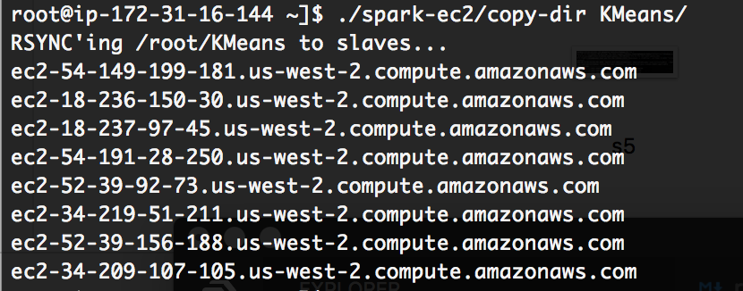
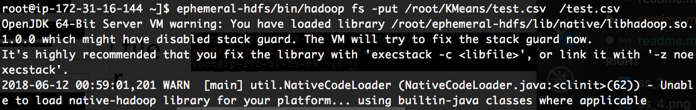
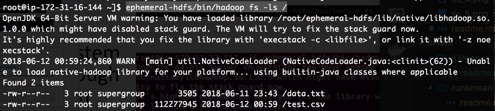
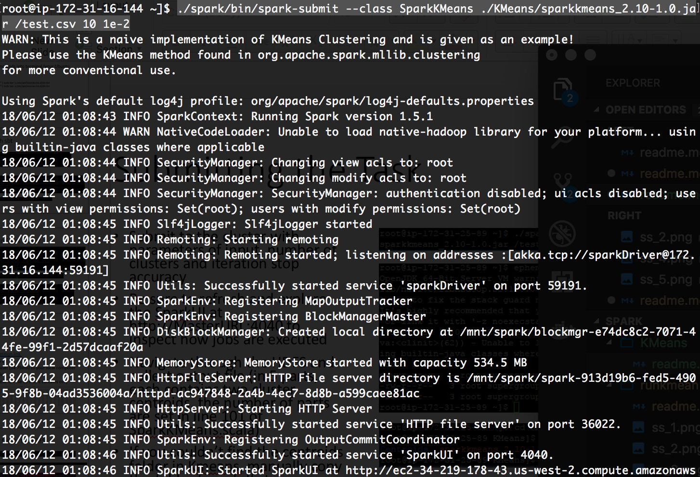
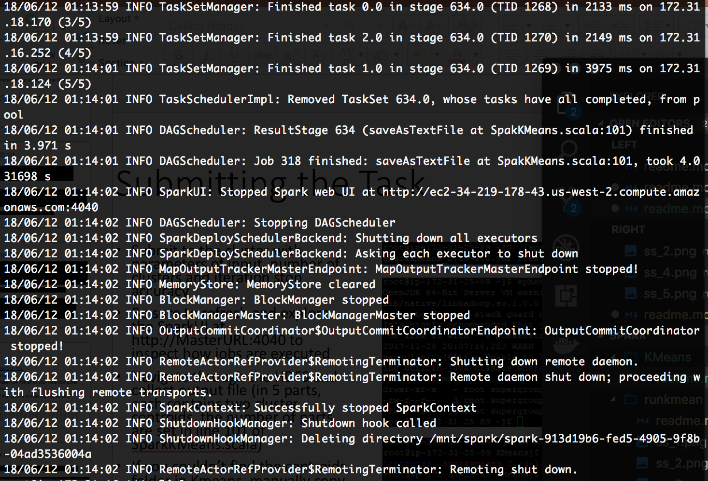
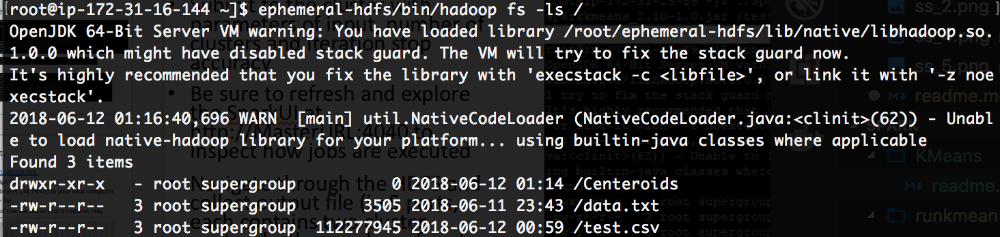
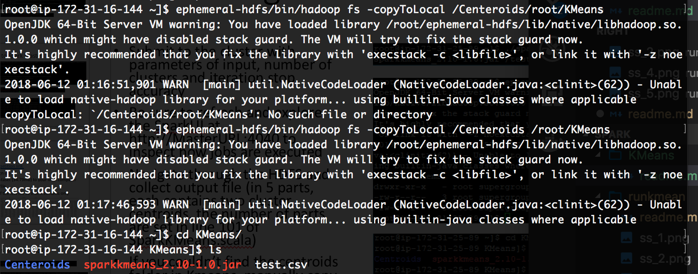

# Compile and run a KMeans Scala Program [Phase 2]

## Copy SpakKMeans.scala to KMeans
`cp ./spark-1.6.0-bin-hadoop2.6/examples/src/main/scala/org/apache/spark/examples/SparkKMeans.scala  ./SparkKMeans/src/main/scala/SpakKMeans.scala`

## Edit SpakKMeans.scala

## Make an .sbt file to specify build parameters
`name := "SparkKMeans" version :="1.0" scalaVersion := "2.10.3" /* dependencies */ libraryDependencies ++= Seq ( "org.apache.spark" %% "spark-core" % "1.6.0", "org.apache.spark" %% "spark-mllib" % "1.6.0", "org.apache.hadoop" % "hadoop-client" % "2.2.0","org.scalanlp" % "breeze-math_2.10" % "0.4")`
## Install sbt build tool package
`echo "deb https://dl.bintray.com/sbt/debian /" | sudo tee -a /etc/apt/sources.list.d/sbt.list`
`echo "deb https://dl.bintray.com/sbt/debian /" | sudo tee -a /etc/apt/sources.list.d/sbt.list`
`sudo apt-get update`
`sudo apt-get install sbt`

## Build *.jar file
`abt package`

## Create KMeans at Master Node

## Upload file to Slave Nodes
`./spark-ec2/copy-dir KMeans`

__Screenshot__

## Move file to hadoop file system
` ephemeral-hdfs/bin/hadoop fs -put /root/KMeans/test.csv  /test.csv`

__Screenshot__

## Browse hadoop file system
`ephemeral-hdfs/bin/hadoop fs -ls /`

__Screenshot__

## Submit task to the cluster
`./spark/bin/spark-submit --class SparkKMeans ./KMeans/sparkkmeans_2.10-1.0.jar /test.csv 10 1e-2`

__Screenshot__

### After long waiting

## Check hadoop file System
`ephemeral-hdfs/bin/hadoop fs -ls /`

__Screenshot__

Find __Centeroids__ folder

## Copy Centeroids folder to local KMeans folder
`ephemeral-hdfs/bin/hadoop fs -copyToLocal /Centeroids /root/KMeans`

__Screenshot__

