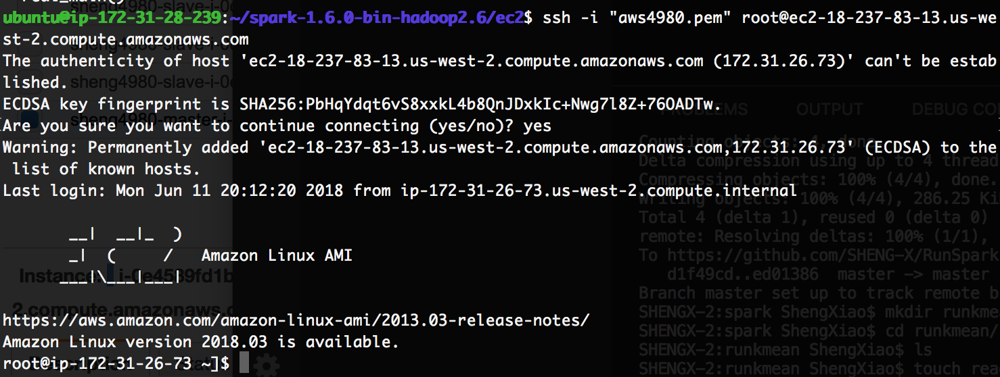
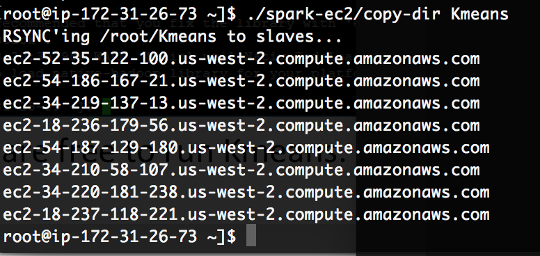
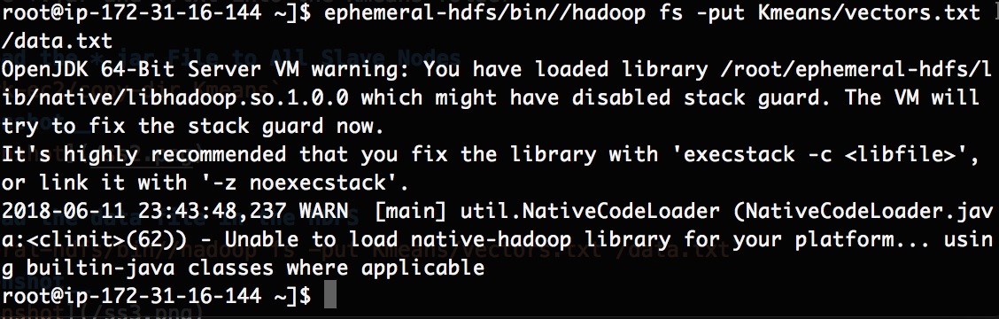
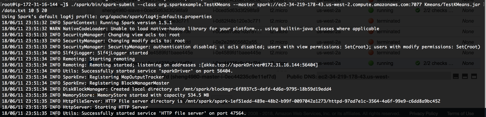
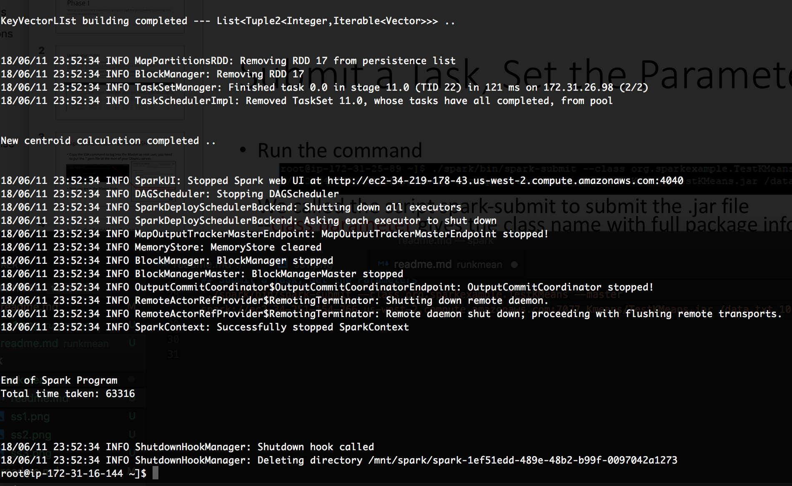

# Run KMeans on EC2 cluster [Phase one]

## Connect to Master from [Ubuntu Server]
+ Find master cluster on AWS instances dash board
+ Hit Connet to find out ssh command to connect `ssh -i "aws4980.pem" root@ec2-18-237-83-13.us-west-2.compute.amazonaws.com`

__Screenshot of Connected__

## Create Kmeans Folder
`mkdir Kmeans`

## Download KMeans Example
`wget http://dmkd.cs.vt.edu/TUTORIAL/Bigdata/Codes/Spark_Kmeans.zip`
`unzip Spark_Kmeans.zip`
Move the *.jar and *.txt into the Kmeans folder 

## Upload the *.jar File to All Slave Nodes
`./spark-ec2/copy-dir Kmeans`

__Screenshot__

## Upload the data file in the HDFS
`ephemeral-hdfs/bin//hadoop fs -put Kmeans/vectors.txt /data.txt`

__Screenshot__

## Submit a Task, Set the Parameters
`./spark/bin/spark-submit --class org.sparkexample.TestKMeans --master spark:// ec2-34-219-178-43.us-west-2.compute.amazonaws.com:7077 Kmeans/TestKMeans.jar /data.txt 10 5 20`
__IMPORTANT:__ You need to change  __ec2-34-219-178-43.us-west-2.compute.amazonaws.com__ to your public DNS

__Screenshot__
+ Start Excution 

+ Result

